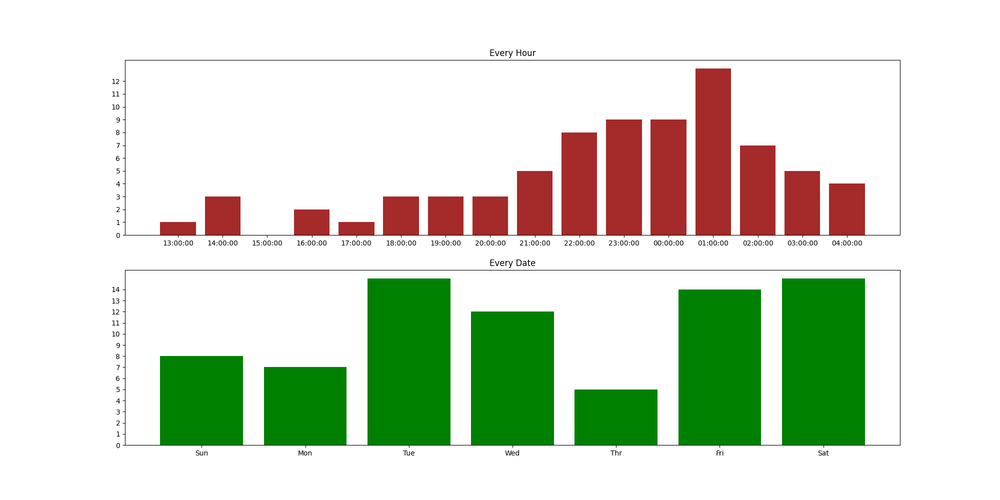

# やりたいこと
Amazonの購入時間を可視化したい

- 何時に買っていることが多いか
- 何曜日に買っていることが多いか

# 手順
1. GmailAPIで注文完了メールを取り出す
2. 受信日時を取り出せるのでそれらを可視化する

# 準備

- Gmail APIから自分用の `credentials.json` をダウンロードして同じディレクトリに置く。
- `pull.py` のemail変数を自分のメールアドレスに変更
- Pipenvで依存関係をインストール（なければPipfileにある依存関係を手動でインストール）

# 実行

Pipenvの場合

```bash
# 取得データを保存
pipenv run pull > created_dates.txt
# 保存データから読み込む
pipenv run draw
```

Pythonでそのまま実行

```bash
# 取得データを保存
python pull.py > created_dates.txt
# 保存データから読み込む
python draw.py
```
# 完成例


# リンク
- [Gmail API](https://developers.google.com/gmail/api)
